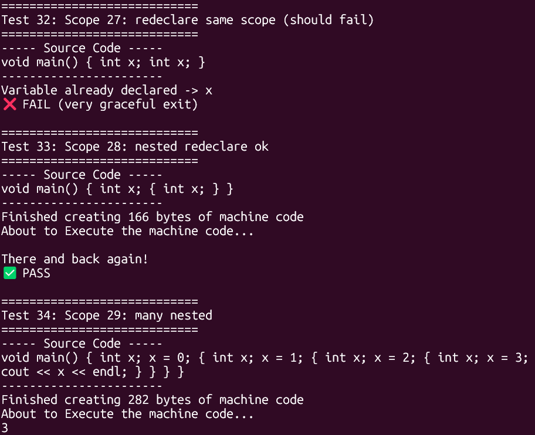

# Personal Compiler

## Overview

This project is a custom-built compiler written in C++ that parses a subset of C++-like syntax and translates it into executable instructions. The system processes raw text input, validates it against defined language rules, and emits low-level instructions that are executed through a custom runtime environment.

Unlike traditional compilers that target existing architectures, this project implements its own instruction model and execution pipeline on Linux, demonstrating core compiler design concepts such as parsing, syntax validation, and instruction generation.

## Features

* Parses structured input using C++-style syntax (e.g., `{}` blocks)
* Supports core language constructs:

  * `if` / `while` / `for` control flow
  * `cout <<` output operations
  * Arithmetic operations and assignment (`+=`, comparisons, etc.)
* Translates high-level syntax into custom machine-level instructions
* Executes compiled instructions through a custom runtime
* Handles nested scopes and block structures

## Tech Stack

* **Language:** C++
* **Environment:** Linux
* **Core Concepts:** Compiler design, parsing, code generation, instruction execution

## Architecture

The compiler follows a simplified compilation pipeline:

1. **Parsing Phase**

   * Reads raw text input and constructs an internal representation based on defined grammar rules
   * Validates syntax such as block structure and control flow statements

2. **Code Generation**

   * Converts parsed structures into a custom instruction set
   * Emits low-level instructions representing program behavior

3. **Execution Engine**

   * Runs generated instructions using a custom-built machine model
   * Simulates execution rather than relying on native CPU compilation

This design demonstrates how high-level constructs are lowered into executable operations.

## Getting Started

### Prerequisites

* Linux environment
* `g++` with C++17 support

### Build

```bash
g++ -std=c++17 -o mycompiler *.cpp
```

### Run

1. Prepare a text file containing supported C++-like syntax
2. Modify or pass the file into the `CodeAndExecute()` function
3. Execute the compiler:

```bash
./mycompiler
```

4. The program will compile the input and display the execution output

## Example Capabilities

* Nested scopes and variable shadowing
* Loop execution (`for`, `while`)
* Conditional branching (`if` statements)
* Output via `cout`

## Screenshot



*(Replace with a screenshot showing test execution and output results)*

## Future Improvements

* Expand supported C++ syntax
* Add lexical analysis stage (tokenization improvements)
* Improve error handling and diagnostics
* Target real assembly output instead of a custom instruction set
* Add optimization passes

## Key Learnings

* Implementation of a full compilation pipeline
* Designing and executing a custom instruction set
* Managing scope and control flow in a compiler
* Bridging high-level syntax with low-level execution
